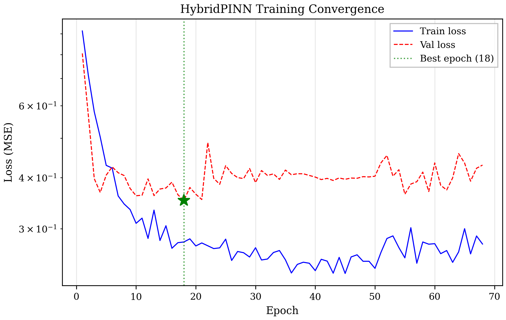
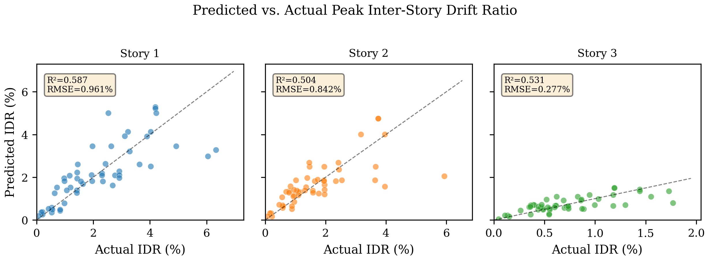
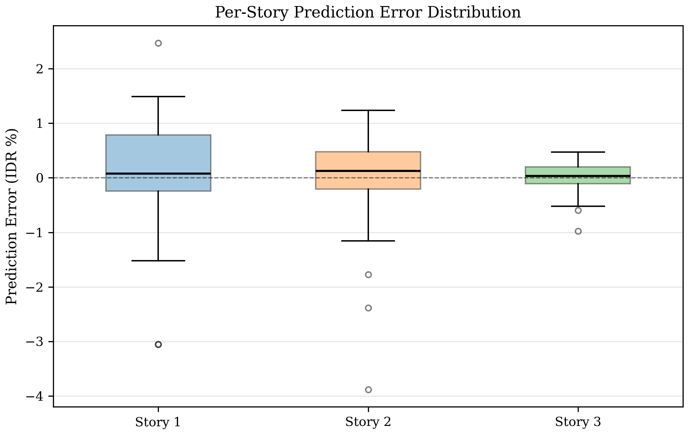

# 4. Results

## 4.1 OpenSeesPy Simulation Results

Nonlinear time history analyses (NLTHA) were performed on a parametric $N$-story RC frame model using OpenSeesPy. Two datasets were generated:

### 4.1.1 Synthetic Validation Dataset

A batch of 20 synthetic ground motions (band-limited white noise) was generated for initial model verification using a 3-story, 3-bay frame ($N=3$).

-   **Convergence Rate**: 100% (20/20 records)
-   **Peak IDR Range**: 0.5%–1.5%
-   **Modal Periods**: $T_1 = 0.695$ s, $T_2 = 0.209$ s, $T_3 = 0.113$ s

### 4.1.2 PEER NGA-West2 Real Data Campaign

A validation subset of 21 real earthquake records from the PEER NGA-West2 database was processed through the same 3-story frame model.

-   **Source Records**: 100 unique RSN events (299 AT2 components available; 21 processed for validation)
-   **Convergence Rate**: 100% (21/21 records)
-   **Peak IDR Range**: 0.2%–1.95%
-   **Notable Records**: RSN121 (Friuli), RSN122 (Friuli), RSN162–164 (Imperial Valley)

## 4.2 Data Pipeline Statistics

The raw simulation data was processed into PyTorch tensors via the automated pipeline.

| Parameter | Synthetic | PEER (Real) |
| :--- | :--- | :--- |
| Source Records | 20 | 21 |
| Total Samples | 228 | 342 |
| Train / Val / Test | 159 / 34 / 35 | 239 / 51 / 52 |
| Tensor Shape (x) | [N, 1, 2048] | [N, 1, 2048] |
| Output Dimension (y) | 3 stories | 3 stories |

**Physics Tensors**: Mass matrix ($M$), restoring forces ($f_{int}$), and kinematic responses ($\dot{u}, \ddot{u}$) were verified non-zero, enabling the physics-informed loss.

## 4.3 PINN Training Performance

### 4.3.1 Synthetic Data (Verification)

-   **Convergence**: Early stopping at **Epoch 66** (patience=50)
-   **Best Validation Loss**: 0.080 (MSE)
-   **Physics Loss**: Active throughout training ($\sim 1.9 \times 10^{-15}$)

### 4.3.2 PEER Real Data (Validation)

-   **Convergence**: Early stopping at **Epoch 68** (patience=50)
-   **Best Validation Loss**: 0.352 (MSE)
-   **Physics Loss**: Active throughout training ($\sim 1.9 \times 10^{-15}$)

*Figure 4: Training and validation loss convergence (PEER real data).*

## 4.4 Prediction Accuracy

| Metric | Synthetic | PEER (Real) |
| :--- | :--- | :--- |
| **Overall $R^2$** | **0.791** | **0.650** |
| **Overall RMSE** | 0.26% | 0.76% |
| Story 1 $R^2$ | 0.645 | 0.587 |
| Story 2 $R^2$ | 0.830 | 0.504 |
| Story 3 $R^2$ | 0.827 | 0.531 |

The reduction in $R^2$ from synthetic to real data is expected and attributable to: (1) the greater complexity and variability of real earthquake frequency content, and (2) the limited size of the validation subset (21 records vs. the planned 100).

*Figure 5: Predicted vs. actual peak inter-story drift ratio (PEER data).*

*Figure 6: Per-story prediction error distribution (PEER data).*

## 4.5 Real-Time Benchmarking

Inference latency was measured on a standard CPU environment (batch size = 1).

| Metric | Value |
| :--- | :--- |
| Device | CPU |
| Pre-processing Latency | 0.141 ms |
| Inference Latency | 0.988 ms |
| Total Latency | ~1.13 ms |
| Throughput (Batch=1) | > 1,300 samples/sec |

This performance is well below the control loop threshold of 10–20 ms required for real-time structural monitoring.
